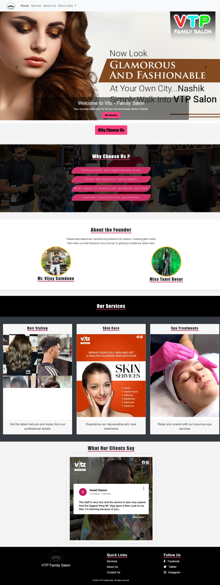

# Vitz Family Salon Website
=========================

Welcome to the Vitz Family Salon website! This is a simple website created using HTML, CSS, and JavaScript. It is designed to provide information about the Vitz Family Salon, including the services they offer, their location and hours, and their contact information.

## Getting Started

To view the website, simply open the `index.html` file in a web browser.

### Prerequisites

To view the website, you will need a web browser (such as Google Chrome, Mozilla Firefox, or Apple Safari).

### Screenshots

### Demo
[Live Demo](https://vitzfamilysalon.netlify.app/)

### Installing

No installation is required to view the website. Simply open the `index.html` file in a web browser.

## Built With

* [HTML](https://developer.mozilla.org/en-US/docs/Web/HTML)
* [CSS](https://developer.mozilla.org/en-US/docs/Web/CSS)
* [JavaScript](https://developer.mozilla.org/en-US/docs/Web/JavaScript)

This HTML
 project is a simple website for the Vitz Family Salon, using CSS for styling and JavaScript for any dynamic elements.

## Contributing

This project is not currently accepting contributions.

## Features

* Home page with information about the salon
* Services page with a list of services offered
* Contact page with a form for sending a message to the salon
* Animated transitions between pages

## Contact

To contact the creator of this project, please send a message to [vishal Valvi](vishalvalvi2529@gmail.com).

## License

This project is licensed under the MIT License - see the `LICENSE` file for details.